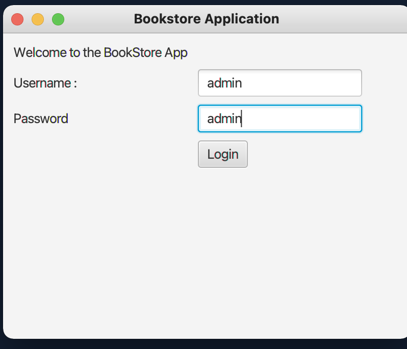
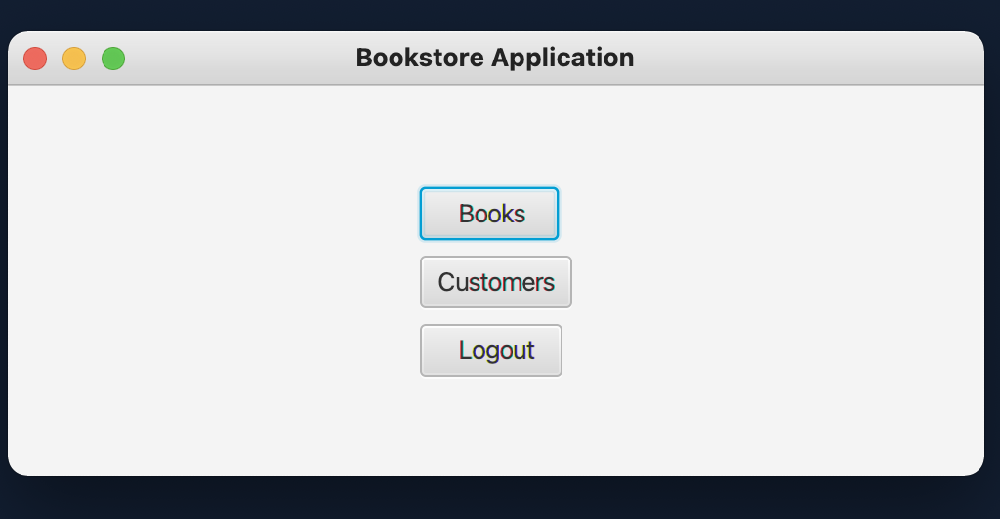
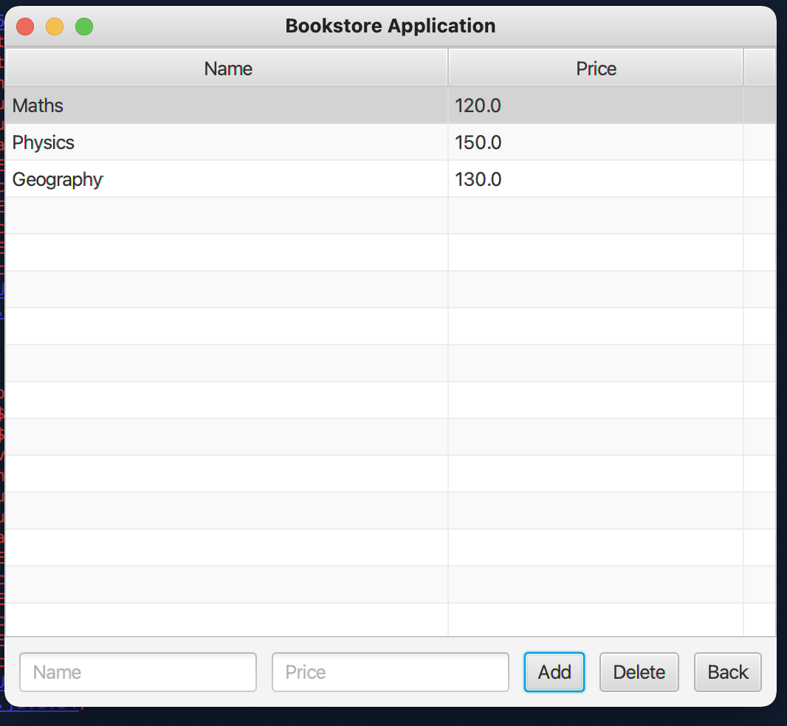
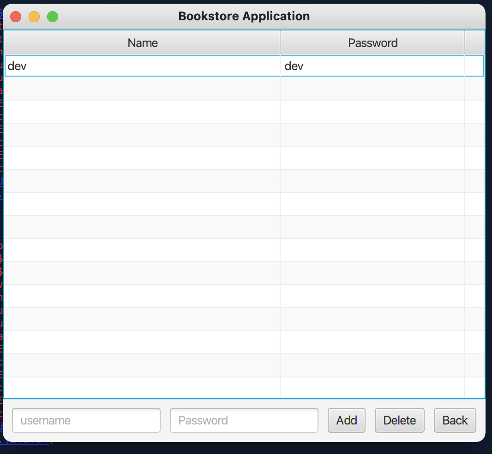
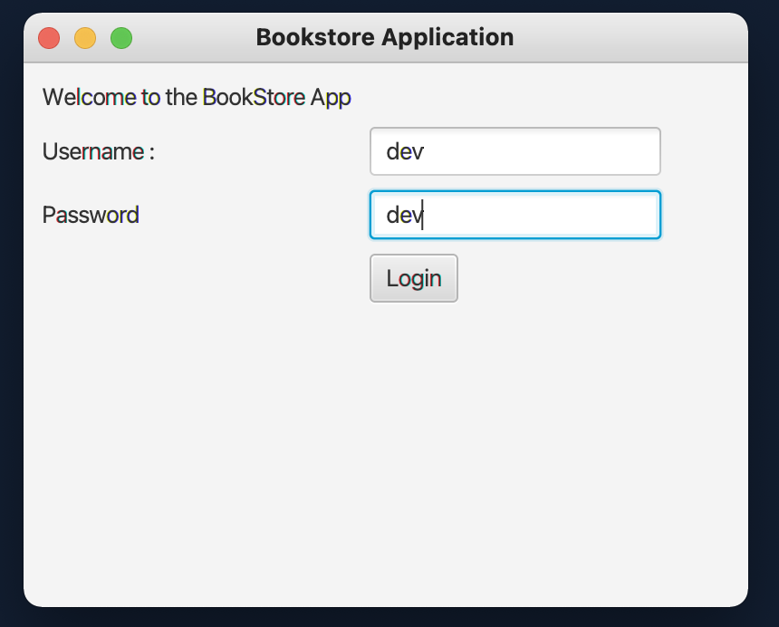
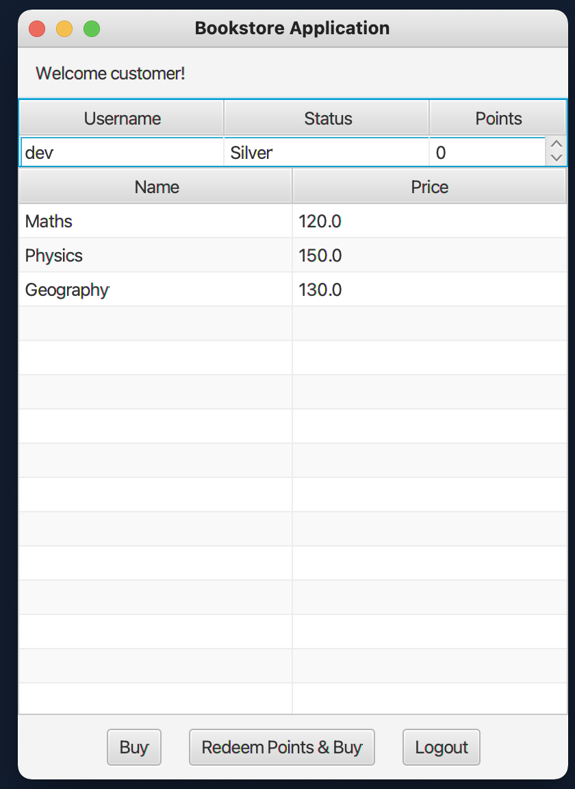

# BookStoreApplication
•Designed a bookstore application using Java and Java-FX by Incorporating Agile principles.
•Developed multiple login screens for the customer side and the owner side; 
•Customer could buy or redeem their loyalty points and buy the books; 
•Owner can sell the books, and the inventory of books is automatically changed

Here the owner of the book store writes their credentials

Now the owner is on their landing page

Owner can add or delete the books and the inventory is changed

Owner can even add the customer's login credentials. This credentials are accessed by the customer when
they want to login to the application

This is the customer's login page

Customer can buy the books that were added by the owner

